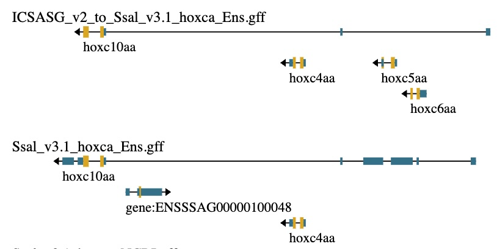

# Experimenting with existing tools to see how they work

## Liftoff

### installation

conda install fails...
pip install fails...
install from source fails...

The failure could be mainly because I am attempting to run this on macOS with arm64 CPU and that there are few packages built for this. After some trial and error I decided to see if I could just use a docker image. Figured out that I could search the [BioContainers registry](https://biocontainers.pro/registry) and found liftoff:

```shell
docker pull quay.io/biocontainers/liftoff:1.6.3--pyhdfd78af_1
```

Not available for arm64 though, but it should work via emulation.

To start bash in the conatainer:


```shell
docker run -it \
  -v "$(pwd)":/workdir -w /workdir \
  quay.io/biocontainers/liftoff:1.6.3--pyhdfd78af_1 \
  bash
```

### initial test

usage: `liftoff -g GFF [-o FILE] target reference`

So to lift the Ensembl annotations from ICSASG_v2 to Ssal_v3.1 the command is:

```shell
liftoff -g data/toy-assemblies/ICSASG_v2_hoxca_Ens.gff \
  -o experiments/liftoff_test/ICSASG_v2_to_Ssal_v3.1_hoxca_Ens.gff \
  data/toy-assemblies/Ssal_v3.1_hoxca.fa \
  data/toy-assemblies/ICSASG_v2_hoxca.fa
```

> Noting that it created a lot of index files in data directory (.fai, .gff_dg, .mmi)

This seemed to work but how do I inspect it???

In JBrowse2 on salmobase under "TOOLS -> Assembly manager" I can add the fasta file as a new assembly.

> Note that JBrowse2 does not tolerate gff features with missing parents! (had to fix that in the toy dataset)

After fixing the toy dataset gff files it was possible to visually compare the annotations between assemblies. It seems to have faithfully lifted over all the features. There are clear differences in the annotation, e.g. Ssal_v3.1 is missing hxc5aa and hoxc6aa, possibly by merging into the hoxc10aa transcript.



Also noticed that the whole hoxcaa cluster has flipped direction between the assemblies. 

The next step is to get some stats about how well the annotations match!

## LiftoffTools

### installation

Going straigth for the docker container this time.

```shell
docker pull quay.io/biocontainers/liftofftools:0.4.3--pyhdfd78af_0

docker run -it \
  -v "$(pwd)":/workdir -w /workdir \
  quay.io/biocontainers/liftofftools:0.4.3--pyhdfd78af_0 \
  bash
```

### LiftoffTools Overview

**LiftoffTools** is a toolkit for comparing gene annotations between genome assemblies, especially suited for outputs from [Liftoff](https://github.com/agshumate/Liftoff). It includes three main modules:

1. **Variants** – identifies sequence differences in protein-coding genes between reference and target assemblies and evaluates their functional effects. **(This is the relevant one)**
2. **Synteny** – compares gene order between assemblies and optionally calculates edit distances.
3. **Clusters** – groups genes into paralogous clusters to detect copy number gains or losses.

---

### **Variants Module Overview**

The **variants** module is designed to detect and categorize sequence-level changes in protein-coding genes after lift-over. It compares each transcript in the reference genome with its counterpart in the target genome, measuring:

* **DNA sequence identity**
* **Protein sequence identity**
* **Functional effects of variants**, including:

  * **Synonymous / nonsynonymous mutations**
  * **Start codon loss**
  * **Frameshifts**
  * **In-frame insertions/deletions**
  * **5′/3′ truncations**
  * **Premature stop codons**

Only the **most severe effect** per transcript is reported.

#### Example command:

```bash
liftofftools variants -r reference.fa -t target.fa -rg reference.gff3 -tg target.gff3
```

#### Output:

A tab-separated file named `variant_effects` with:

1. Reference transcript ID
2. Target transcript ID
3. DNA sequence identity (0–1.0)
4. Amino acid sequence identity (or 'NA' if non-coding)
5. Most severe variant effect (or 'NA' if non-coding)

This module is useful for assessing functional conservation or divergence of genes after annotation lift-over between genome assemblies.

### initial test

```bash
reference_fa=data/toy-assemblies/ICSASG_v2_hoxca.fa
target_fa=data/toy-assemblies/Ssal_v3.1_hoxca.fa
reference_gff3=data/toy-assemblies/ICSASG_v2_hoxca_Ens.gff
target_gff3=data/toy-assemblies/Ssal_v3.1_hoxca_Ens.gff

out=experiments/liftofftools_test
mkdir -p $out

liftofftools variants -r $reference_fa -t $target_fa -rg $reference_gff3 -tg $target_gff3 -dir $out

```

Here is a part of the resulting table (there was no header in the table):

| Reference Transcript ID      | Target Transcript ID           | DNA Sequence Identity | Amino Acid Sequence Identity | Most Severe Variant Effect |
|-----------------------------|-------------------------------|----------------------|-----------------------------|---------------------------|
| transcript:ENSSSAT00000110410 | transcript:ENSSSAT00000110410 | 0.917                | 0.891                       | start_lost                |
| transcript:ENSSSAT00000110421 | transcript:ENSSSAT00000110421 | 0.992                | 0.992                       | inframe_deletion          |
| transcript:ENSSSAT00000110436 | transcript:ENSSSAT00000110436 | 0.871                | 0.836                       | frameshift                |
| transcript:ENSSSAT00000110439 | transcript:ENSSSAT00000110439 | 1.0                  | 1.0                         | identical                 |
| transcript:ENSSSAT00000110460 | transcript:ENSSSAT00000110460 | 0.997                | 0.992                       | nonsynonymous             |
| transcript:ENSSSAT00000110464 | transcript:ENSSSAT00000110464 | 0.998                | 1.0                         | synonymous                |
| transcript:ENSSSAT00000143692 | unmapped                      |                      |                             |                           |

#### observations

* Comparison is done per transcript (haven't tested non coding transcripts yet)
* All mapped transcript IDs match!
* The cbx5 transcript does not map, even though the lifted over transcript has exactly tha same CDS!

I suspect that it is actually only comparing transcripts with same ID

### test2

What happens if I try to compare NCBI with Ensembl (should be no matching IDs)

```bash
reference_fa=data/toy-assemblies/ICSASG_v2_hoxca.fa
target_fa=data/toy-assemblies/Ssal_v3.1_hoxca.fa
reference_gff3=data/toy-assemblies/ICSASG_v2_hoxca_NCBI.gff
target_gff3=data/toy-assemblies/Ssal_v3.1_hoxca_Ens.gff

out=experiments/liftofftools_test2
mkdir -p $out

liftofftools variants -r $reference_fa -t $target_fa -rg $reference_gff3 -tg $target_gff3 -dir $out
```

As suspected there was no results as none of the IDs mapped. Even got a warning:

> UserWarning: There are no gene features with matching IDs in the reference and target annotation

#### conclusions

This does not seem to be the tool I need. I believe the purpose of this tool is to check the quality of an annotation that has been lifted over. This can be useful for comparing different assemblies but is not so useful for comparing different existing annotations!

The lifted-over annotations can be useful though, as they can be directly compared with tools that work within an assembly. In that case, it would be necessary take into account differences between the orinal and lifted over annotations.

Example: we want to compare **ref** with **target** but have to lift over **ref** before comparing. It could be that the assembly introduces differences but **ref_lifted** is identical to **target**. In that case `liftofftools variants` could be used to find differences caused by assembly differences. 

**ref** -liftover-> **ref_lifted** <-compare-> **target**

Also the tool could be used to annotate differences for the annotations that have the same IDs


