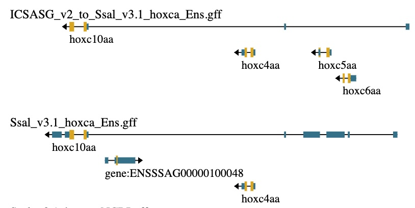
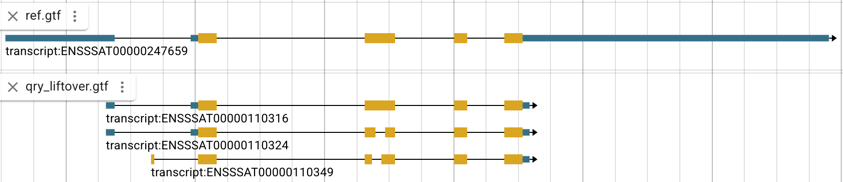
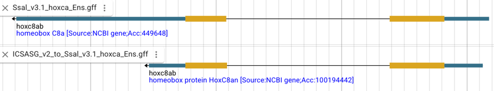
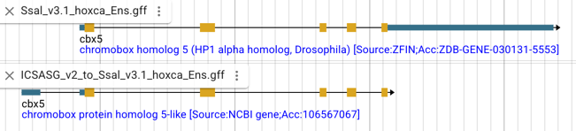

# Experimenting with existing tools to see how they work

## Liftoff

### installation

conda install fails...
pip install fails...
install from source fails...

The failure could be mainly because I am attempting to run this on macOS with arm64 CPU and that there are few packages built for this. After some trial and error I decided to see if I could just use a docker image. Figured out that I could search the [BioContainers registry](https://biocontainers.pro/registry) and found liftoff:

```shell
docker pull quay.io/biocontainers/liftoff:1.6.3--pyhdfd78af_1
```

Not available for arm64 though, but it should work via emulation.

To start bash in the conatainer:


```shell
docker run -it \
  -v "$(pwd)":/workdir -w /workdir \
  quay.io/biocontainers/liftoff:1.6.3--pyhdfd78af_1 \
  bash
```

### initial test

usage: `liftoff -g GFF [-o FILE] target reference`

So to lift the Ensembl annotations from ICSASG_v2 to Ssal_v3.1 the command is:

```shell
liftoff -g data/toy-assemblies/ICSASG_v2_hoxca_Ens.gff \
  -o experiments/liftoff_test/ICSASG_v2_to_Ssal_v3.1_hoxca_Ens.gff \
  data/toy-assemblies/Ssal_v3.1_hoxca.fa \
  data/toy-assemblies/ICSASG_v2_hoxca.fa
```

> Noting that it created a lot of index files in data directory (.fai, .gff_dg, .mmi)

This seemed to work but how do I inspect it???

In JBrowse2 on salmobase under "TOOLS -> Assembly manager" I can add the fasta file as a new assembly.

> Note that JBrowse2 does not tolerate gff features with missing parents! (had to fix that in the toy dataset)

After fixing the toy dataset gff files it was possible to visually compare the annotations between assemblies. It seems to have faithfully lifted over all the features. There are clear differences in the annotation, e.g. Ssal_v3.1 is missing hxc5aa and hoxc6aa, possibly by merging into the hoxc10aa transcript.



Also noticed that the whole hoxcaa cluster has flipped direction between the assemblies. 

The next step is to get some stats about how well the annotations match!

## LiftoffTools

### installation

Going straigth for the docker container this time.

```shell
docker pull quay.io/biocontainers/liftofftools:0.4.3--pyhdfd78af_0

docker run -it \
  -v "$(pwd)":/workdir -w /workdir \
  quay.io/biocontainers/liftofftools:0.4.3--pyhdfd78af_0 \
  bash
```

### LiftoffTools Overview

**LiftoffTools** is a toolkit for comparing gene annotations between genome assemblies, especially suited for outputs from [Liftoff](https://github.com/agshumate/Liftoff). It includes three main modules:

1. **Variants** – identifies sequence differences in protein-coding genes between reference and target assemblies and evaluates their functional effects. **(This is the relevant one)**
2. **Synteny** – compares gene order between assemblies and optionally calculates edit distances.
3. **Clusters** – groups genes into paralogous clusters to detect copy number gains or losses.

---

### **Variants Module Overview**

The **variants** module is designed to detect and categorize sequence-level changes in protein-coding genes after lift-over. It compares each transcript in the reference genome with its counterpart in the target genome, measuring:

* **DNA sequence identity**
* **Protein sequence identity**
* **Functional effects of variants**, including:

  * **Synonymous / nonsynonymous mutations**
  * **Start codon loss**
  * **Frameshifts**
  * **In-frame insertions/deletions**
  * **5′/3′ truncations**
  * **Premature stop codons**

Only the **most severe effect** per transcript is reported.

#### Example command:

```bash
liftofftools variants -r reference.fa -t target.fa -rg reference.gff3 -tg target.gff3
```

#### Output:

A tab-separated file named `variant_effects` with:

1. Reference transcript ID
2. Target transcript ID
3. DNA sequence identity (0–1.0)
4. Amino acid sequence identity (or 'NA' if non-coding)
5. Most severe variant effect (or 'NA' if non-coding)

This module is useful for assessing functional conservation or divergence of genes after annotation lift-over between genome assemblies.

### initial test

```bash
reference_fa=data/toy-assemblies/ICSASG_v2_hoxca.fa
target_fa=data/toy-assemblies/Ssal_v3.1_hoxca.fa
reference_gff3=data/toy-assemblies/ICSASG_v2_hoxca_Ens.gff
target_gff3=data/toy-assemblies/Ssal_v3.1_hoxca_Ens.gff

out=experiments/liftofftools_test
mkdir -p $out

liftofftools variants -r $reference_fa -t $target_fa -rg $reference_gff3 -tg $target_gff3 -dir $out

```

Here is a part of the resulting table (there was no header in the table):

| Reference Transcript ID      | Target Transcript ID           | DNA Sequence Identity | Amino Acid Sequence Identity | Most Severe Variant Effect |
|-----------------------------|-------------------------------|----------------------|-----------------------------|---------------------------|
| transcript:ENSSSAT00000110410 | transcript:ENSSSAT00000110410 | 0.917                | 0.891                       | start_lost                |
| transcript:ENSSSAT00000110421 | transcript:ENSSSAT00000110421 | 0.992                | 0.992                       | inframe_deletion          |
| transcript:ENSSSAT00000110436 | transcript:ENSSSAT00000110436 | 0.871                | 0.836                       | frameshift                |
| transcript:ENSSSAT00000110439 | transcript:ENSSSAT00000110439 | 1.0                  | 1.0                         | identical                 |
| transcript:ENSSSAT00000110460 | transcript:ENSSSAT00000110460 | 0.997                | 0.992                       | nonsynonymous             |
| transcript:ENSSSAT00000110464 | transcript:ENSSSAT00000110464 | 0.998                | 1.0                         | synonymous                |
| transcript:ENSSSAT00000143692 | unmapped                      |                      |                             |                           |

#### observations

* Comparison is done per transcript (haven't tested non coding transcripts yet)
* All mapped transcript IDs match!
* The cbx5 transcript does not map, even though the lifted over transcript has exactly tha same CDS!

I suspect that it is actually only comparing transcripts with same ID

### test2

What happens if I try to compare NCBI with Ensembl (should be no matching IDs)

```bash
reference_fa=data/toy-assemblies/ICSASG_v2_hoxca.fa
target_fa=data/toy-assemblies/Ssal_v3.1_hoxca.fa
reference_gff3=data/toy-assemblies/ICSASG_v2_hoxca_NCBI.gff
target_gff3=data/toy-assemblies/Ssal_v3.1_hoxca_Ens.gff

out=experiments/liftofftools_test2
mkdir -p $out

liftofftools variants -r $reference_fa -t $target_fa -rg $reference_gff3 -tg $target_gff3 -dir $out
```

As suspected there was no results as none of the IDs mapped. Even got a warning:

> UserWarning: There are no gene features with matching IDs in the reference and target annotation

#### conclusions

This does not seem to be the tool I need. I believe the purpose of this tool is to check the quality of an annotation that has been lifted over. This can be useful for comparing different assemblies but is not so useful for comparing different existing annotations!

The lifted-over annotations can be useful though, as they can be directly compared with tools that work within an assembly. In that case, it would be necessary take into account differences between the original and lifted over annotations.

Example: we want to compare **ref** with **target** but have to lift over **ref** before comparing. It could be that the assembly introduces differences but **ref_lifted** is identical to **target**. In that case `liftofftools variants` could be used to find differences caused by assembly differences. 

**ref** -liftover-> **ref_lifted** <-compare-> **target**

Also the tool could be used to annotate differences for the annotations that have the same IDs


## GffCompare

### installation

Added `gffcompare` and `gffread` to the conda environment in `environment.yml` and installed them with conda.

```bash
conda install -y -c bioconda -c conda-forge gffcompare gffread
```

Note: gffcompare works best with GTF; we convert GFF3 to GTF with gffread first.

### compare liftover vs Ensembl on Ssal_v3.1

Inputs:

- Reference GFF3: `data/toy-assemblies/Ssal_v3.1_hoxca_Ens.gff`
- Query (liftover) GFF3: `experiments/liftoff_test/ICSASG_v2_to_Ssal_v3.1_hoxca_Ens.gff`

Commands used:

```bash
out=experiments/gffcompare_test
mkdir -p "$out"

# Convert GFF3 -> GTF for both inputs
gffread -E -T -o "$out/ref.gtf" data/toy-assemblies/Ssal_v3.1_hoxca_Ens.gff
gffread -E -T -o "$out/qry_liftover.gtf" experiments/liftoff_test/ICSASG_v2_to_Ssal_v3.1_hoxca_Ens.gff

# Compare liftover (query) against Ensembl (reference)
gffcompare -r "$out/ref.gtf" -o "$out/gffc" "$out/qry_liftover.gtf"
```

Key outputs (in `experiments/gffcompare_test`):

- `gffc.stats` – summary sensitivity/precision at base, exon, intron, transcript, locus levels
- `gffc.qry_liftover.gtf.tmap` – per-transcript classification vs reference (class codes)
- `gffc.annotated.gtf` – query transcripts annotated with comparison results
- `gffc.tracking`, `gffc.refmap`, `gffc.loci` – mapping/tracking details

### results

Summary from `gffc.stats` (query has 28 transcripts, reference has 28):

- Base level: sensitivity 46.3, precision 83.1
- Exon level: sensitivity 45.2, precision 56.7
- Intron level: sensitivity 53.6, precision 78.9
- Intron chain: sensitivity 57.1, precision 57.1
- Transcript level: sensitivity 57.1, precision 57.1
- Locus level: sensitivity 71.4, precision 71.4
- Matching transcripts: 16; matching intron chains: 16; matching loci: 15
- Missed exons: 28/84 (33.3%); novel exons: 3/67 (4.5%)
- Missed introns: 20/56 (35.7%); novel introns: 4/38 (10.5%)
- Missed loci: 2/21 (9.5%); novel loci: 0/21 (0%)

Class-code breakdown from `gffc.qry_liftover.gtf.tmap`:

- `=`: 16 (exact intron chain match)
- `j`: 9 (shared splice junctions; likely isoform differences)
- `c`: 2 (query fully contained in reference)
- `k`: 1 (query contains reference)

For reference, here is an overview of all the codes from the [gffcompare documentation](https://ccb.jhu.edu/software/stringtie/gffcompare.shtml):


### observations

- Over half of the transcripts (16/28) are exact matches after liftover, indicating very good agreement for many models.
- Most remaining transcripts share junctions (`j`) suggesting small structural differences (e.g., alternative start/end or exon boundary adjustments) rather than entirely novel structures.
- No novel loci were introduced by liftover; a small number of loci were missed relative to Ensembl (2/21), consistent with the visual differences seen around hoxc10aa.

### what stats can we get with gffcompare

Directly from `gffc.stats` and `.tmap` we can report:

- Sensitivity and precision at multiple levels (base, exon, intron, intron-chain, transcript, locus)
- Counts of matching transcripts/loci and counts of missed/novel exons and introns
- Per-transcript class codes (`=`, `j`, `c`, `k`, etc.) and their counts
- Lists of exact matches vs partial matches for further inspection

### Manual inspection in genome browser

#### Closer look at cbx5 on chromosome 15
To get a better idea how to use the gffcompare results I will focus on a single gene:



>Note: The gene features are gone in the gff to gtf conversion, although it keeps track of the gene_id as an attribute. Also noticed that the transcript ID is the ID attribute of the transcript.

I asked the codex agent to describe the similarities/differences in the cbx5 gene

"Region 15 cbx5: One liftover transcript is an exact match to Ensembl (perfect agreement), while two additional liftover isoforms differ slightly (shared junctions) with one lacking a start codon. This suggests the liftover carries additional isoform diversity relative to the Ensembl Ssal_v3.1 model at this locus."

One of the outputs from gffcompare is the .tmap file that shows the mapping between query and ref transcripts (here is the gene in question):
| ref_gene_id            | ref_id                        | class_code | qry_gene_id            | qry_id                        | num_exons | FPKM     | TPM      | cov      | len | major_iso_id                  | ref_match_len |
|------------------------|-------------------------------|------------|------------------------|-------------------------------|-----------|----------|----------|----------|-----|-------------------------------|---------------|
| gene:ENSSSAG00000110153 | transcript:ENSSSAT00000247659 | =          | gene:ENSSSAG00000065738 | transcript:ENSSSAT00000110316 | 5         | 0.000000 | 0.000000 | 0.000000 | 801 | transcript:ENSSSAT00000110316 | 3895          |
| gene:ENSSSAG00000110153 | transcript:ENSSSAT00000247659 | j          | gene:ENSSSAG00000065738 | transcript:ENSSSAT00000110324 | 6         | 0.000000 | 0.000000 | 0.000000 | 726 | transcript:ENSSSAT00000110316 | 3895          |
| gene:ENSSSAG00000110153 | transcript:ENSSSAT00000247659 | j          | gene:ENSSSAG00000065738 | transcript:ENSSSAT00000110349 | 6         | 0.000000 | 0.000000 | 0.000000 | 630 | transcript:ENSSSAT00000110316 | 3895          |

> note that the FPKM/TPM is only applicable when an expression tracking file (.t_data.ctab from Cufflinks/StringTie) is provided.

> note that the "lacking a start codon" is not available in the gff compare but comes from the liftover, which added it to the gff attribute

Other than the ID mapping, gff_compare classifies the match with a code. 

It looks like it is only doing a junction comparison, i.e. it has no concept of how this affects the protein sequence.

Another output is the .refmap file which seems to be just a subset of the .tmap file that just includes the good matches (code `=` and `c`)

| ref_gene_id            | ref_id                        | class_code | qry_id_list                                               |
|------------------------|-------------------------------|------------|----------------------------------------------------------|
| gene:ENSSSAG00000110153 | transcript:ENSSSAT00000247659 | =          | gene:ENSSSAG00000065738\|transcript:ENSSSAT00000110316   |

#### Genes with no good match:

This one got code `j` because the intron junction is off by 6bp (not visible in the image):



This one got code `j` because the query had an extra exon in the 5' UTR:



Genes with no overlap will not be listed in the gffcompare output.

### Conclusion from the first gffcompare experiment

GFFcompare seems to be a good tool for generating a list of overlapping transcripts between annotations. However, the classification is purely based on intron matching and and not on the effects it have on the coding sequence. This could serve as a first step and coding sequence based comparison could be added later.

Also noted that liftoff adds some potential useful annotation to the transcripts. e.g., the mRNA record for ENSSSAT00000110349 has 'valid_ORF=False;missing_start_codon=True'.

The test I ran was reference based, which is not optimal if there is no clear "reference". After looking at the documentation it seems like there might be a way to run gffcompare without a reference. I should try this.

### Multi-query gffcompare run (no explicit reference)

Goal: compare Ensembl vs Liftoff annotations symmetrically by providing both as queries (no `-r`). This produces a consensus and tracking across datasets, instead of reference-relative class codes.

Inputs (GTFs converted earlier with gffread):

- q1: `experiments/gffcompare_test/ref.gtf` (Ensembl Ssal_v3.1 HoxC A)
- q2: `experiments/gffcompare_test/qry_liftover.gtf` (Liftoff from ICSASG_v2 to Ssal_v3.1)

Command:

```bash
out=experiments/gffcompare_multi
mkdir -p "$out"
gffcompare -o "$out/gffc_multi" \
  experiments/gffcompare_test/ref.gtf \
  experiments/gffcompare_test/qry_liftover.gtf
```

Key outputs:

- `gffc_multi.combined.gtf` – combined/consensus annotation across both queries
- `gffc_multi.tracking` – maps each consensus transcript (TCONS_*) to contributing q1/q2 transcripts within XLOC_ loci
- `gffc_multi.loci`, `gffc_multi.stats` – union loci and per-query summaries

Summary (`gffc_multi.stats`):

- q1: 28 mRNAs in 21 loci
- q2: 28 mRNAs in 21 loci
- Union super-loci: 20
- Consensus transcripts written: 40 (to `gffc_multi.combined.gtf`)

Differences vs using `-r`:

- No `.tmap` with class codes relative to a chosen reference; instead, use `tracking` to see how each consensus model relates to each query.
- No sensitivity/precision; stats summarize each query and the union.
- Better for neutral exploration of relationships (e.g., extra UTR exon or isoforms) without privileging either annotation.

Examples (from `gffc_multi.tracking`):

- cbx5 chr13: Ensembl (`q1:...ENSSSAT00000177260`) and Liftoff (`q2:...ENSSSAT00000143756`) appear under the same locus group but map to different TCONS due to the extra 5′ UTR exon in q2 (previously labeled `k` in reference-based run).
- cbx5 chr15: `q1` transcript aligns with multiple `q2` isoforms (`…110316`, `…110324`, `…110349`) in the same/related XLOC groups, making isoform multiplicity explicit.

Conclusion: reference-free multi-query mode emphasizes consensus and cross-mapping. Use it to explore structural relationships; use `-r` when you want class codes and sensitivity/precision metrics against a designated reference.

## ParsEval (AEGeAn)

### installation

Attempted conda install on macOS arm64, but no package is available on bioconda/conda-forge for this platform. Therefore, use the BioContainers image (works like Liftoff/LiftoffTools):

```bash
docker pull quay.io/biocontainers/aegean:<tag>

docker run -it \
  -v "$(pwd)":/workdir -w /workdir \
  quay.io/biocontainers/aegean:<tag> \
  bash
```

Inside the container, the binary is `ParsEval`.

Note: `environment.yml` includes a comment explaining that ParsEval is not available for osx‑arm64 via conda.

### compare liftover vs Ensembl on Ssal_v3.1

Inputs:

- Reference GFF3: `data/toy-assemblies/Ssal_v3.1_hoxca_Ens.gff`
- Query (liftover) GFF3: `experiments/liftoff_test/ICSASG_v2_to_Ssal_v3.1_hoxca_Ens.gff`
- Genome FASTA (same assembly): `data/toy-assemblies/Ssal_v3.1_hoxca.fa`

Example command (inside container):

```bash
out=experiments/parseval_test
mkdir -p "$out"

# ParsEval expects both annotations to be on the same assembly build.
# -r: reference; -t: test; -g: genome FASTA; -w: write reports in directory
# Note: the binary name is lowercase: `parseval`
# Basic text report (single file):
parseval -f text -o "$out/parseval.txt" -w \
         data/toy-assemblies/Ssal_v3.1_hoxca_Ens.gff \
         experiments/liftoff_test/ICSASG_v2_to_Ssal_v3.1_hoxca_Ens.gff
```

Key outputs (this run):

- `experiments/parseval_test/parseval.txt` – single text report with repeated per‑locus comparison sections, each including:
  - CDS/exon/UTR structure comparison (counts, sensitivity, specificity, F1, annotation edit distance)
  - Nucleotide‑level metrics per category (matching coefficient, sensitivity, specificity, F1, AED)
  - Inline dumps of the compared GFF3 features for the involved transcripts

### notes vs gffcompare

- ParsEval is locus‑centric and CDS‑aware: it computes per‑gene/per‑transcript statistics including CDS effects and reports whether differences affect the coding sequence (e.g., UTR‑only vs CDS‑changing). This aligns with our goal to attach confidence and similarity per gene (see README).
- gffcompare is structure‑centric with class codes (`=`, `j`, `c`, `k`) and global sensitivity/precision; it does not assess CDS/protein impact. Useful for quick structural overlap, less so for coding changes.

### expected insights on the toy data

- cbx5 (chr13): liftover has an extra 5′ UTR exon but identical CDS coordinates to Ensembl; ParsEval should report UTR differences with CDS conserved.
- cbx5 (chr15): one liftover isoform matches Ensembl exactly; additional liftover isoforms differ structurally; ParsEval should distinguish CDS‑preserving vs CDS‑altering differences per transcript within the locus report.

### initial results (ParsEval text report)

Report file: `experiments/parseval_test/parseval.txt`

- cbx5 (chr13, locus `seqid=13:41179690-41398770`):
  - Compared `ENSSSAT00000177260` (Ensembl) vs `ENSSSAT00000143756` (Liftoff)
  - Results:
    - CDS structures match perfectly (all 5 CDS segments match)
    - Exons: 5 reference vs 6 prediction; 4 match, 1 ref and 2 pred do not match (extra 5′ UTR exon in liftoff)
    - Start/stop codons align; overall CDS conserved, UTR differs

- cbx5 (chr15, locus `seqid=15:92946040-93192783`):
  - Pair 1: `ENSSSAT00000247659` (Ensembl) vs `ENSSSAT00000110316` (Liftoff)
    - CDS structures match perfectly (4/4)
    - Exons: 5 reference, 5 prediction; 3 match, 2 differ (UTR differences)
    - Nucleotide‑level (CDS): matching coefficient 1.000, AED 0.000 (perfect)
  - Additional liftoff isoform `ENSSSAT00000110324`:
    - Parsed in a separate comparison within the locus; shows altered CDS segmentation relative to its paired reference transcript (non‑cbx5 within the same locus window), with 0 matching CDS segments and AED 1.000 for that pairing, indicating a CDS‑altering isoform relative to that reference.
  - Takeaway: At this locus, liftoff contains one CDS‑identical isoform to Ensembl (good agreement) plus additional isoforms with structural and CDS differences.

General observations:

- ParsEval’s per‑locus sections make it straightforward to identify whether differences are confined to UTRs or affect CDS (our priority for per‑gene confidence and similarity).
- The tool also reports nucleotide‑level metrics and AED per category (CDS/UTR), which can be aggregated per gene if needed.

Notes:

- The run emitted warnings about missing `##sequence-region` lines and corrected missing CDS phases in the Liftoff GFF3; neither affected the comparisons.


### next steps

- Run ParsEval container locally to generate the per‑locus reports in `experiments/parseval_test`.
- Extract a concise per‑gene summary (CDS unchanged vs changed; exon/intron sensitivity/precision; matched isoforms) for inclusion in the README summary table.
